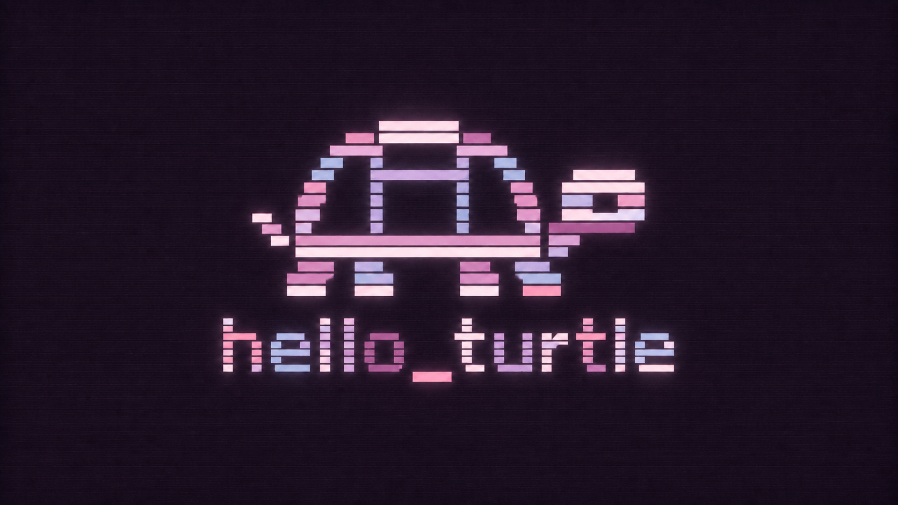

# Plum CRT



Plum CRT is a dark Omarchy theme built from black-plum, blush, dusty rose,
mauve, violet, and lavender-blue. The included wallpaper carries the same
palette through a segmented `hello_turtle` mark with CRT scanlines, grain, and
bloom.

The theme includes a matching Plymouth and SDDM unlock screen. Select it from
Style > Unlock or run:

```sh
omarchy plymouth set by theme plum-crt
```

## Install

```sh
omarchy theme install https://github.com/tomrplummer/omarchy-plum-crt-theme.git
```

Omarchy applies the theme after installation. `colors.toml` supplies the app
and terminal colors, `icons.theme` selects the Yaru purple icons, and the
`unlock.png` files add Plum CRT to the unlock-screen picker.
